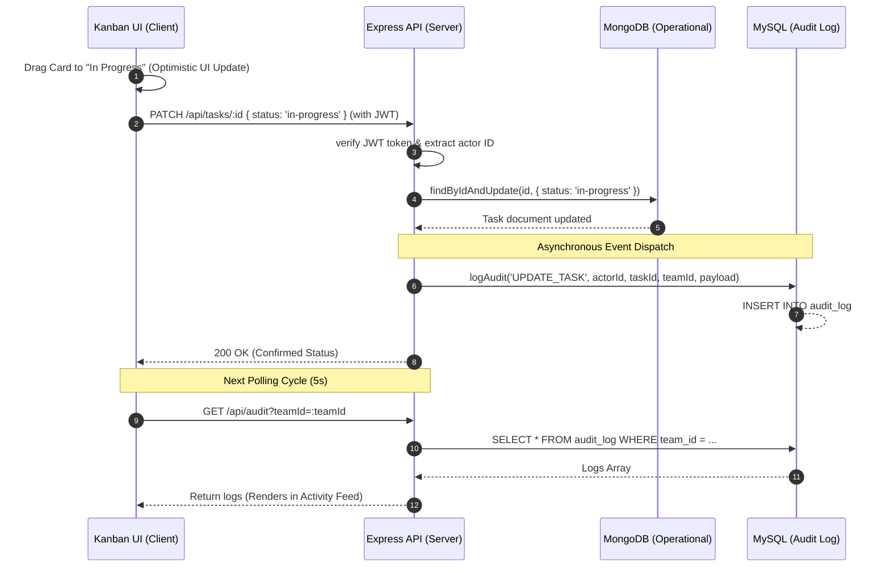

# Architecture & System Overview

This document provides a comprehensive view of the system architecture, database integrations, and cross-layer data flows for the Team Task Management Platform.

---

## High-Level Architecture Diagram

```mermaid
graph TD
  subgraph Frontend (React SPA)
    UI[React Components & Pages]
    AC[AuthContext]
    AX[Axios Client / Interceptors]
    PR[Protected Routes]
  end

  subgraph Backend (Express REST API)
    JWT[JWT Middleware]
    CTRL[Controllers]
    AL[Audit Logger]
  end

  subgraph Databases
    MDB[(MongoDB Atlas - Operational)]
    MSQL[(MySQL - Audit Logs)]
  end

  UI --> AC
  UI --> PR
  PR --> AX
  AX -- HTTP/JWT --> JWT
  JWT --> CTRL
  CTRL -- Mongoose CRUD --> MDB
  CTRL -- logAudit() --> AL
  AL -- mysql2 pool --> MSQL
```

---

## Frontend Components

The React SPA is structured as a component-based application using state management and path protection:

* **`AuthContext`**: Manages the logged-in user state (`user`, `token`, `isAuthenticated`). Automatically stores/retrieves the JWT token in `localStorage` and configures requests with the authorization header interceptor.
* **`ProtectedRoute`**: Evaluates `isAuthenticated` and verifies role credentials (`allowedRoles=['manager']` vs `'member'`). Redirects unauthorized visitors to `/login` or back to the `/dashboard`.
* **`MainLayout`**: Implements the structural sidebar navigation and app header. Controls menu visibility based on user roles (hiding the "Reports" tab for members).
* **Dashboard Page**: Renders system-wide counts and extracts the 5 most recently created tasks using a copy-based immutable sorting pattern.
* **Team Detail Page (Kanban Board)**: Coordinates `@dnd-kit/core` drag-and-drop operations, status update API patches, optimistic updates, state rollback logic, and dynamic initials rendering for task assignees.
* **Activity Feed**: Displays chronological logs matching actions on the current team, complete with custom pagination controls and relative timestamps.
* **Reports Page**: Uses Recharts to plot weekly task completions, a contributor leaderboard ranking user action frequency, and task overdue percentages. Includes a CSV export trigger.

---

## Backend Modules

The backend uses a dual-database approach to decouple standard transactional records from immutable event trails:

* **MongoDB (Operational Data)**: Stores transactional schemas (`User`, `Team`, `Task`) requiring high read/write scalability, schema flexibility, and deep document linking.
* **MySQL (Audit Logs)**: Manages query-intensive, flat history logging inside a structured `audit_log` table. Decoupled from operational flows to guarantee data safety and transaction speed.
* **JWT Middleware (`protect` & `restrictTo`)**:
  * `protect`: Extracts, decodes, and validates the bearer token from incoming requests, binding the active user identifier to `req.user`.
  * `restrictTo`: Performs role verification by looking up user credentials in MongoDB, verifying authorization before running sensitive endpoints.
* **Reports Aggregation**: Combines MongoDB operational statistics (active vs overdue tasks) with complex MySQL aggregation queries (tasks completed grouped by week, action frequency sorted by actor).

---

## Data Flow: Task Update & Log Lifecycle

The flow diagram below shows what happens when a user drags a task card from **To Do** to **In Progress** on the Kanban board:



In the event of a network or server failure during step 2, the **Kanban UI catch block** intercepts the error and automatically triggers a state rollback, snapping the task card back to its original column layout to maintain UI integrity.